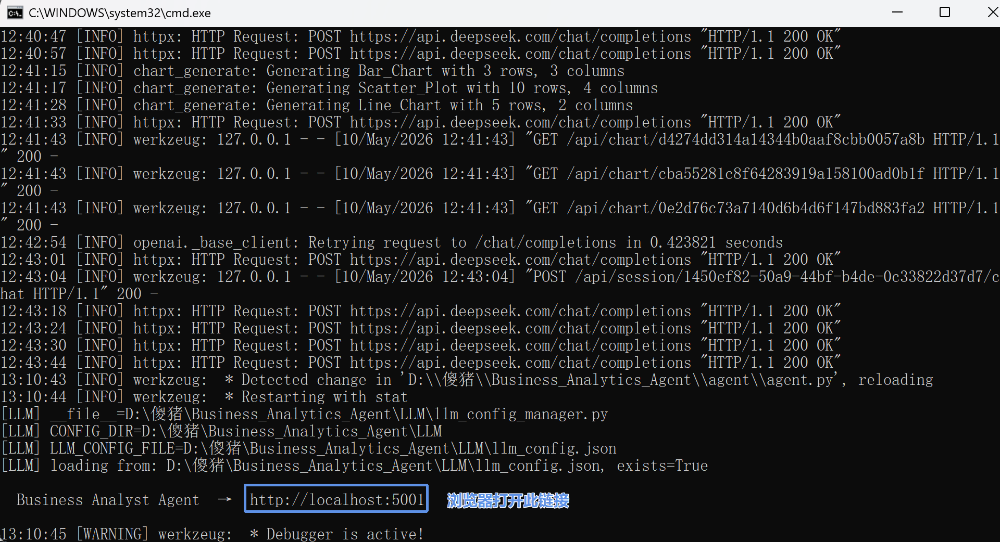
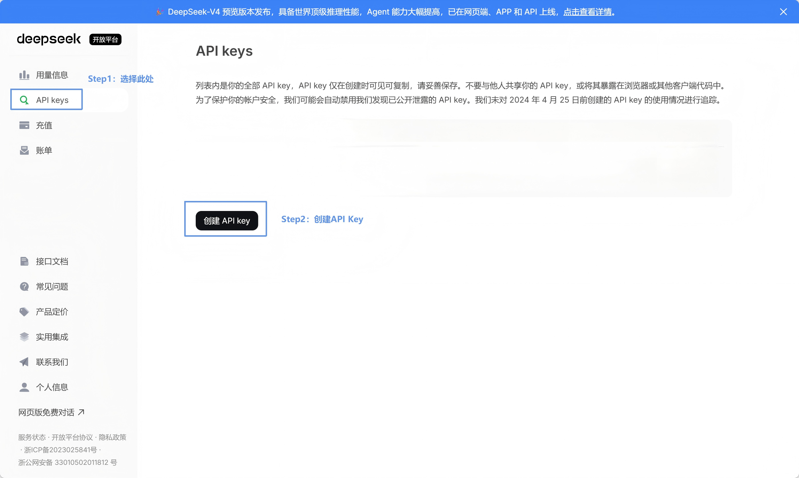

# Business Analyst Agent

<p align="center">
  
</p>

<p align="right"><a href="./README.md">中文</a></p>


> An AI Agent built for business analytics.  
> After connecting to a data source, users can ask questions in natural language and the system will automatically:
>
> - Detect schema
> - Generate & run SQL
> - Generate charts
> - Produce concise business insights

---

## ✨ Overview

**Business Analyst Agent** is a conversational business data analysis system.  
Upload an Excel/CSV file or connect to a database, then ask questions like chatting:

```text
How does sales trend over the last 3 months?
Which region has the highest profit?
Generate a user growth chart.
```

The system will automatically:

1. Understand intent
2. Inspect data schema
3. Generate SQL
4. Execute queries
5. Recommend appropriate charts
6. Summarize insights

It also supports **SSE (Server-Sent Events)** streaming so you can see the analysis progress in real time.

---

## 🚀 Key Features

### 🧠 Natural Language Analytics
No need to write SQL manually. The agent turns plain language into SQL + results + insights.

### 🔌 Multiple Data Sources
Supported:

- Excel
- CSV
- SQLite
- MySQL
- PostgreSQL
- SQL Server

Planned:

- DuckDB
- Spark

### 📊 Smart Chart Recommendation

| Category | Chart Type |
|---|---|
| **对比类** COMPARING | Marimekko_ABS（马里美科-绝对值）、Marimekko_PCT（马里美科-百分比）、Bar_Chart（柱状图）、Grouped_Bar_Chart（分组柱状图）、Stacked_Bar_Chart（堆叠柱状图）、Diverging_Bar_Chart（对比条形图）、Dot_Plot（点图）、Waffle（华夫格）、Bullet_Chart（靶心图）、Sankey_Chart（桑基图）、Heatmap（热力图）、Waterfall（瀑布图） |
| **时间趋势类** TIME | Line_Chart（折线图）、Circular_Line_Chart（圆形折线图）、Slope_Chart（斜率图）、Sparkline（迷你图）、Bump_Chart（凹凸图）、Cycle_Chart（周期图）、Area_Chart（面积图）、Stacked_Area_Chart（堆叠面积图）、Horizon_Chart（地平线图）、Connected_Scatter（连线散点图） |
| **分布类** DISTRIBUTION | Histogram_Pareto_chart（直方图与帕累托图）、Pyramid_Chart（金字塔图）、Error_Bar_Chart（误差条形图）、Box-and-Whisker_Plot（箱线图）、Violin_Chart（小提琴图）、Ridgeline_Plot（山脊线图）、Beeswarm_Plot（分簇散点图）、stem_leaf（茎叶图） |
| **地理类** GEOSPATIAL | Flow_Map（动态流向图）、Dot_Density_Map（点密度地图）、Choropleth_Map（面量图） |
| **关系类** RELATIONSHIP | Scatter_Plot（散点图）、Bubble_Plot（气泡图）、Radar_Charts（雷达图）、Chord_Diagram（弦图）、Arc_Chart（弧图）、Network_Diagram（网络图）、Parallel_Coordinates_Plot（平行坐标图） |
| **占比类** PART-TO-WHOLE | Treemap（矩形树图）、Sunburst_Diagram（旭日图）、Nightingale_Chart（南丁格尔玫瑰图）、Pie_Chart（饼图） |


The agent selects charts automatically based on the query result.

### ⚡ SSE Real-time Feedback
Streaming progress like:

```text
[1/4] Reading schema...
[2/4] Generating SQL...
[3/4] Running query...
[4/4] Creating chart & insights...
```

### 🤖 Configurable LLM Providers
Built-in support:

- **DeepSeek** (default: `deepseek-chat`)
- **OpenAI** (default: `gpt-4o-mini`)
- **Anthropic Claude** (default: `claude-3-5-haiku-20241022`)

Also supports any **OpenAI SDK compatible API** via custom:

- `base_url`
- `model`
- `api_key`

---

## 🖼️ UI Preview

### Data Preview


---
### Data Query


---

### Auto Generated Chart


---

## Installation

### Option 1: Windows One-click Start (Recommended)

#### 1) Download and install the package


### Method 1: Installation Package Download (Recommended)

#### 1) Download the installation package


#### 2) Unzip the package, then double-click to run directly in the project directory:

**Windows Users**

```bat
start.bat
```

> Note: The first time you run `start.bat`, it will automatically configure the runtime environment, which may take a while. On subsequent runs, there will be no waiting.

**Mac Users**

① Use the script `start.command`  
② Grant execution permissions in the terminal:  
   ```bash
   chmod +x start.command
   ```  
③ Double-click `start.command` to run.  

> Note: The first time you run it, it may be blocked by macOS security policies. To resolve this:  
> - Right-click `start.command` → Select "Open" → Confirm "Open" again, or  
> - Run the following command in the terminal:  
>   ```bash
>   xattr -d com.apple.quarantine start.command
>   ```

#### 2) Extract and Run via Command Line (Backup Method)

**① Windows:**
Navigate to the project directory (or hold Shift + right-click inside the project folder to open PowerShell):
```bash
cd \Data-Analysis-Agent (Replace with your actual path)
```

Install dependencies:
```bash
pip install -r requirements.txt
```

Start the service:
```bash
python app.py
```

**② Mac:**
Navigate to the project directory:
```bash
cd Data-Analysis-Agent
```

Install dependencies:
```bash
pip3 install -r requirements.txt
```

Start the service:
```bash
python3 app.py
```

#### 3) Open `http://localhost:5001` in your browser

This is a local address and will not leak any information. Please use it with confidence.



---

### Option 2: One-Click Install + Launch (Still testing, unstable)

#### Windows (PowerShell)

```powershell
iwr -useb https://raw.githubusercontent.com/Zafer-Liu/Data-Analysis-Agent/main/install.ps1 | iex
```

After installation, you can start it in either of the following ways:

- Double-click to run (Windows):
  ```bat
  %USERPROFILE%\data-analysis-agent.bat
  ```
- Or start manually from the project directory:
  ```powershell
  cd $env:USERPROFILE\.data-analysis-agent\Data-Analysis-Agent
  .\.venv\Scripts\activate
  python app.py
  ```

#### macOS / Linux (Shell)

```bash
curl -fsSL https://raw.githubusercontent.com/Zafer-Liu/Data-Analysis-Agent/main/install.sh | sh
```

After installation, launch with:

```bash
data-analysis-agent
```

If you see `command not found`, add `~/.local/bin` to your PATH (in `~/.bashrc` or `~/.zshrc`):

```bash
export PATH="$HOME/.local/bin:$PATH"
```


---


### Method 3: Install via GitHub (Command Line)

#### 1) Clone the repository

```bash
git clone https://github.com/Zafer-Liu/Data-Analysis-Agent.git
```

#### 2) Enter the project directory

```bash
cd Data-Analysis-Agent
```

#### 3) Install dependencies

```bash
pip install -r requirements.txt
```

#### 4) Start the service

```bash
python app.py
```

---

## Access URL

```text
http://localhost:5001
```

---

# 🛠 Slash Commands

| Command | Status | Description |
|---|---|---|
| `/chart` | ✅ | Force priority chart generation |
| `/sql` | ✅ | Execute SQL directly |
| `/analyze` | ✅ | In-depth statistical analysis |
| `/tree` | ✅ | Decision tree analysis |
| `/kmeans` | ✅ | K-Means clustering analysis |
| `/data` | ✅ | Data profiling and preview |
| `/inset` | ✅ | Missing value imputation |
| `/winsorize` | ✅ | Winsorization (outlier replacement) |
| `/trimming` | ✅ | Trimming (outlier removal) |
| `/export` | ✅ | Export data file |
| `/report` | ✅ | Export Word/PDF report |
| `/ppt` | ✅ | Export PowerPoint presentation |
| `/status` | ✅ | View task status |
---

## 📁 Suggested Project Structure

```text
Business-Analyst-Agent/
│
├── app.py
├── requirements.txt
├── start.bat
│
├── Function/
│   ├── Charts_generation/
│   │   ├── charts/
│   │   └── registry.py
│   ├── SQL/
│   ├── LLM/
│   └── DataSource/
│
├── Images/
└── README.md
```

---

## ⚙️ Configuration

### LLM Setup
If you see “LLM not configured”, open the sidebar ⚙ and fill in:

- API Key
- Base URL (optional)
- Model

Save to apply.

---

## 🗺️ Roadmap
## Version Development Log
- [Version_Update_Log](Version_Update_Log.md)
- [Version_Update_Log_EN](Version_Update_Log_EN.md)
## ✅ Phase 1
- Conversational analytics + multi data sources + 43 charts + SSE streaming
## 🔲 Phase 2
- Drag-and-drop dashboards
## ✅ Phase 3
- `/report` automated report export (Word/PDF)
## 🔲 Phase 4
- DuckDB / Spark support for big data

---

## ❓ FAQ

**Q: It says LLM is not configured.**  
A: Fill in your API key in the sidebar ⚙ and save.

**Q: Chart links disappear after restart.**  
A: The generated charts are stored in the local directory \outputs\charts.

**Q: How to Obtain an API Key?**
Here is an example using Deepseek. The steps are as follows:





---

## 📄 License
Apache License 2.0

---

## ⭐ Goal
Make business analytics as easy as chatting.
